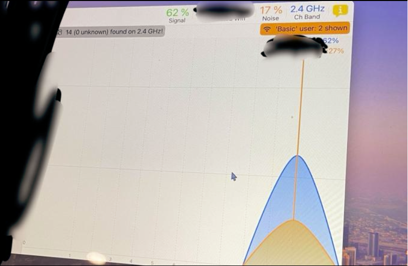

# wifi-interference-analysis
A hands-on project focused on diagnosing and resolving wireless connectivity issues using Wi-Fi spectrum analysis. This investigation identified interference sources, hardware limitations, and channel congestion affecting network performance.

## **Project Overview**

In this project, I analyzed a client's poor wireless connectivity using a Wi-Fi analyzer and identified several key issues impacting network stability and performance. The assessment revealed electromagnetic interference, high noise levels, channel overlap, and outdated hardware limitations. I provided actionable recommendations to improve signal quality, bandwidth, and connection reliability.

## **Key Issues Identified**
- **Electromagnetic Interface (EMI):**
The router was installed inside an electric panel room with thick concrete walls, causing severe signal obstruction and interference.

- **Channel Congestion & Overlap:**
Despite using non-overlapping channels, spectrum analysis revealed significant overlap from nearby networks, contributing to interface.

- **High Noise Levels:**
The Wi-Fi analyzer reported **17% noise**, resulting in packet loss, random disconnections, and instability.

- **Outdated Hardware Limitations:**
The router only supported the **2.4GHz band**, which has limited channels and performs poorly in high-density environments.

## **Recommendation Summary**
Upgrading to a **dual-band router (2.4GHz + 5GHz)** to achieve:

- More channels to minimize interference
- Higher bandwidth for modern devices
- Improved stability and reliable connectivity

## **Screenshots**

### **1. Wi-Fi Spectrum Analysis**
Captured Wi-Fi analyzer results showing signal strength, noise percentage, and channel distribution across the 2.4GHz band.

## **Tools & Techniques**

- **Wi-Fi Analyzer Tools:**
    - Wi-Fi spectrum scanning
    - Signal-to-noise ratio (SNR) assessment
    - Channel overlap analysis

- **Network Diagnostic Techniques:**
    - Identifying EMI sources
    - Evaluating router placement
    - Assessing hardware limitations
    - Troubleshooting channel congestion

- **Wireless Networking Skills:**
- Wi-Fi spectrum analysis
- Electromagnetic interference diagnostics
- Channel optimization (2.4GHz / 5GHz)
- Network performance troubleshooting

## **Purpose**
The purpose of this project was to gain practical experience in diagnosing real-world wireless connectivity issues using professional Wi-Fi analysis tools. By evaluating signal strength, interference, noise, and hardware constraints, I learned how to identify root causes of network instability and provide effective recommendations for improving wireless performance.